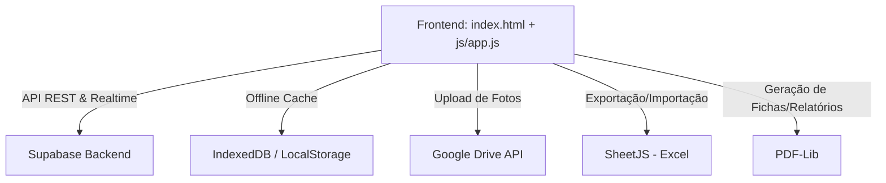

# Documento de Requisitos do Produto (PRD) — Gestor RVS Escolar 2026

Este documento estabelece as especificações técnicas, funcionais e de estrutura do sistema **Gestor RVS Escolar 2026**, desenvolvido para a Escola Estadual Dr. Romildo Veloso e Silva (SEDUC/PA). O sistema funciona como um portal unificado para controle escolar, gestão pedagógica, monitoramento de frequência (inclusive via reconhecimento facial) e comunicação com responsáveis.

---

## 1. Visão Geral do Sistema e Arquitetura

O sistema é estruturado como uma **Single Page Application (SPA)** no frontend e utiliza o **Supabase** como backend serverless. 



### Arquitetura Tecnológica
1. **Frontend**: HTML5, Vanilla CSS3 (Design Responsivo, Grid/Flexbox) e JavaScript Vanilla.
2. **Bibliotecas Importantes**:
   - `lucide-icons` para iconografia.
   - `SheetJS (XLSX)` para leitura e escrita de planilhas Excel.
   - `pdf-lib.js` para geração de PDFs no cliente.
   - `Supabase JS Client` para integração com o banco de dados.
3. **Mecanismo Offline-First**: Filas de operações no LocalStorage (`sincronizarFilaOffline` e `_enfileirarOp`) garantindo persistência temporária no IndexedDB/LocalStorage caso a conexão falhe, sincronizando posteriormente com o Supabase.

---

## 2. Modelagem do Banco de Dados (Supabase/PostgreSQL)

O banco de dados relacional é estruturado nas seguintes tabelas centrais:

### 2.1. Tabela: `turmas`
Armazena as informações das classes ativas na escola.
- `id` (UUID, Chave Primária): Identificador único da turma.
- `code` (TEXT, Único): Código legível da turma (ex: "9º ANO A").
- `serie` (TEXT): Série correspondente (ex: "9º Ano").
- `turno` (TEXT): Turno de aula, com restrição CHECK: `Manhã`, `Tarde`, `Noite`.
- `professor` (TEXT): Nome do professor conselheiro/regente da turma.

### 2.2. Tabela: `alunos`
Armazena a ficha cadastral do aluno.
- `id` (UUID, Chave Primária): Identificador único do aluno.
- `matricula` (TEXT, Único): Número de matrícula (internamente vinculado ao CPF).
- `nome` (TEXT): Nome completo do estudante.
- `data_nascimento` (DATE): Data de nascimento.
- `turma_id` (UUID): Referência (FK) para `turmas(id)`.
- `turma` (TEXT): Cópia denormalizada do código da turma para performance de renderização.
- `turno` (TEXT): Turno correspondente.
- `rota` (TEXT): Nome da rota de transporte escolar (Padrão: `'Sem transporte'`).
- `responsavel` (TEXT): Nome do responsável legal.
- `contato` (TEXT): Telefone de contato do responsável.
- `instagram` (TEXT): Campo legado utilizado tecnicamente para armazenar o **e-mail** do aluno/responsável.
- `status` (TEXT): Situação do aluno, com restrição CHECK: `ativo`, `transferido`, `evadido`.
- `foto_url` (TEXT): Link da foto do aluno, hospedada e integrada ao Google Drive.

### 2.3. Tabela: `frequencia`
Armazena a presença diária dos estudantes em dois momentos (Entrada e Saída).
- `id` (UUID, Chave Primária): Identificador único da chamada.
- `aluno_id` (UUID): FK de `alunos(id)` com cláusula `ON DELETE CASCADE`.
- `turma_id` (UUID): FK de `turmas(id)`.
- `data` (DATE): Data letiva correspondente (Padrão: data atual).
- `tipo` (TEXT): Período da chamada, com CHECK: `entrada`, `saida`.
- `status` (TEXT): Situação de presença, com CHECK: `P` (Presença), `F` (Falta), `FJ` (Falta Justificada).
- `consolidado` (BOOLEAN): Define se a chamada daquele turno foi fechada (trancada) pela coordenação.
- *Chave de Unicidade*: `UNIQUE (aluno_id, data, tipo)` impede duplicidades de chamadas para o mesmo período no mesmo dia.

---

## 3. Especificações das ABAs (Módulos de Interface)

A interface SPA oculta/exibe seções aplicando a classe `.active` em elementos `<div class="page" id="page-[nome]">`.

---

### ABA 1: Alunos (`page-alunos` e `page-ficha-aluno`)

O módulo de alunos oferece a interface de listagem, inserção individual, importação em lote e um dossiê acadêmico e comportamental detalhado de cada estudante.

```
+---------------------------------------------------------------------------------+
|                               CADASTRO DE ALUNOS                                |
| [⬇ Modelo Importação]  [📥 Importar Alunos]  [🗑 Excluir Aluno]  [+ Novo Aluno]   |
+---------------------------------------------------------------------------------+
|  [🔍 Buscar por nome...]                                 [Todas as turmas  v]   |
+---------------------------------------------------------------------------------+
|  CPF           | Nome                  | Turma     | Turno   | Status  | Ações  |
|  123.456.789-0 | Fulano de Tal         | 9º ANO A  | Manhã   | Ativo   | [📋 Ficha] |
+---------------------------------------------------------------------------------+
```

#### Funcionalidades da Listagem (`page-alunos`)
- **Visualização Primária**: Exibe uma tabela com colunas: CPF (chave do sistema), Nome Completo, Turma, Turno, Rota de Transporte, Nome do Responsável, Status e um botão de ação para abrir a ficha individual do aluno.
- **Filtros Dinâmicos**: Barra de pesquisa para busca em tempo real por *Nome*, *CPF* ou *Turma*, além de um seletor dropdown (`#filtro-turma-alunos`) para filtrar por turmas específicas.
- **Importação Automatizada via Excel (`importarAlunos()`)**:
  - Aceita arquivos `.xlsx` e `.xls`.
  - Processamento via biblioteca `SheetJS`.
  - O sistema automaticamente descobre turmas presentes na planilha que não constam no banco de dados e as insere previamente (padrão: Turno Manhã, Professor "A Definir").
  - Mapeia colunas por expressões regulares (`/nome/i`, `/cpf/i`, `/turma/i`, `/respons/i`, `/whats|fone/i`, `/rota/i`, `/nasc/i`).
  - Realiza validação de CPF (11 dígitos numéricos) e deduplica registros pelo CPF antes do envio para o banco (`upsert` no Supabase com base na restrição da coluna `matricula`).
- **Exportação de Modelo**: Botão para baixar um arquivo modelo em Excel (`downloadModelo()`) facilitando a estruturação dos dados pelo usuário.

#### Funcionalidades da Ficha Individual/Dossiê (`page-ficha-aluno`)
- **Perfil e Metadados**: Exibe a foto do aluno, CPF, matrícula (CPF), Turma atual, Turno e Rota.
- **Painel de Foto**: Permite capturar uma foto via câmera (integração direta com o dispositivo de vídeo) ou carregar da galeria do computador. A foto é salva no Google Drive através da função `enviarFotoAlunoParaDrive` e a URL de acesso é salva na ficha do aluno.
- **Indicadores Rápidos (Resumo)**:
  - Faltas consolidadas acumuladas.
  - Total de ocorrências disciplinares vinculadas.
  - Quantidade de contatos e responsáveis cadastrados.
  - Quantidade de boletins publicados.
- **Timeline Acadêmica & Ocorrências**: Histórico completo de movimentações, justificativas de faltas e eventos, além de um histórico visual com cores diferenciadas para ocorrências (resolvidas ou pendentes).
- **Ações Rápidas de Fundo de Tela (Footer)**:
  - Alteração direta de dados do aluno.
  - Transferência/Mudança de turma (`abrirMudancaTurma()`).
  - Registro rápido de ocorrência disciplinar (`abrirOcorrDaFicha()`).
  - Geração de relatório em PDF individual da Ficha do Aluno (`gerarPDFFichaAluno()`).

---

### ABA 2: Turmas (`page-turmas`)

Este módulo gerencia as agrupações de alunos e atua como a espinha dorsal de controle de chamadas e relatórios.

```
+---------------------------------------------------------------------------------+
|                            GERENCIAMENTO DE TURMAS                              |
| [⬇ Modelo Importação]   [📥 Importar Turmas]   [🗑 Excluir]  [+ Nova Turma]      |
+---------------------------------------------------------------------------------+
|  +------------------------+  +------------------------+  +-------------------+  |
|  |       9º ANO A         |  |       1º ANO B         |  |    TURMA TEMP     |  |
|  |  Serie: 9º Ano         |  |  Serie: 1º Ano         |  |  [Ações de Turma] |  |
|  |  Turno: Manhã          |  |  Turno: Tarde          |  +-------------------+  |
|  |  Professor: Dr. Mario  |  |  Professor: Ana Maria  |                         |
|  +------------------------+  +------------------------+                         |
+---------------------------------------------------------------------------------+
```

#### Funcionalidades
- **Visualização em Grid**: Renderiza blocos gráficos (cards) para cada turma contendo dados cruciais: código identificador, série, turno e professor conselheiro.
- **Criação e Edição Individual**: Modal dedicada com validações de unicidade de código e formatação.
- **Importação via Excel (`importarTurmas()`)**: Permite cadastrar várias turmas em lote através de arquivo de importação padronizado.
- **Ações Internas de Turma**:
  - Gerar listagem em PDF de alunos daquela turma (`baixarListaAlunosTurmaPDF`).
  - Visualizar listagem de alunos inline (`abrirListaAlunosTurma`).
  - Solicitação de alteração cadastral ou exclusão.
- **Zerar Sistema**: Um botão de emergência restrito (`zerarSistema()`) com destaque vermelho escuro, permitindo limpar os dados das tabelas para preparar o ano letivo seguinte.

---

### ABA 3: Frequência (`page-frequencia`)

O módulo de controle de presença é dividido em duas etapas para maximizar a precisão pedagógica e evitar fraudes em consolidações.

#### Etapa 1: Seleção de Turno e Turma
- O usuário escolhe o Turno (Manhã, Tarde, Noite) e a Turma em dropdowns alimentados em tempo real a partir das turmas salvas no banco.
- Botão "Carregar Lista de Alunos" inicia a interface de chamada ativa (`carregarChamada()`).

#### Etapa 2: Painel de Chamada Ativa (Entrada & Saída)
- **Seletor de Dia Letivo**: Carrega as datas configuradas na agenda da escola (calendário letivo). O sistema exibe um badge indicando se o dia selecionado é letivo, feriado ou avaliação.
- **Fluxo Condicional Duplo (Entrada -> Saída)**:
  - O sistema opera em dois painéis independentes: **Entrada** e **Saída**.
  - O painel de **Saída** é trancado por padrão. A edição e gravação da chamada de Saída são bloqueadas até que a chamada de Entrada daquela turma no dia letivo esteja devidamente preenchida e **Consolidada**.
- **Botões Rápidos**: "Presença para Todos" preenche todos os alunos pendentes como presentes (`P`) de uma vez e sincroniza com o banco.
- **Tipos de Presença**:
  - `P` (Presença): Valor padrão.
  - `F` (Falta): Gera destaque visual vermelho.
  - `FJ` (Falta Justificada): Abre modal complementar para anexar a origem/motivo da justificativa (ex: Atestado Médico, Responsabilidade dos Pais, Decisão da Coordenação).
- **Integração de Evasão Automática**:
  - Caso um aluno seja marcado como Presente (`P`) na **Entrada** e Ausente (`F`) na **Saída**, o sistema aciona a função de **Evasão Escolar**.
  - Um popup/alerta é exibido na tela (`triggerAlert()`).
  - Uma ocorrência comportamental com o tipo `'evasao'` é **gerada automaticamente** na tabela `ocorrencias` e vinculada à ficha do aluno, permitindo que a coordenação escolar tome providências imediatas.
- **Fechamento e Segurança (Consolidação e Trancamento)**:
  - Ao clicar em "Consolidar", os status são gravados com a flag `consolidado = true`. Uma vez consolidadas, as presenças daquele período ficam trancadas para modificações ordinárias (ficam cinzas e desabilitadas na tela).
  - **Desbloqueio de Emergência**: Caso o professor ou secretário cometa um erro e precise alterar a chamada após a consolidação, ele deve clicar em "🔓 Desbloquear" e inserir a senha mestra administrativa (`RVS@gestor#2026`).

---

### ABA 4: Painel Consolidado do Dia (`updateConsolidado()`)
Abaixo dos cards de chamada de Entrada e Saída, é montada uma tabela de auditoria consolidando o resultado final do aluno no dia letivo:
- Se Entrada = `P` e Saída = `P` -> Status Final: **Presente** (Badge Verde)
- Se Entrada = `P` e Saída = `F` -> Status Final: **Evasão** (Badge Vermelho + Aviso "Verificar")
- Se Entrada = `F` ou Saída = `F` -> Status Final: **Falta** (Badge Vermelho)
- Se Entrada = `FJ` ou Saída = `FJ` -> Status Final: **Falta Justificada** (Badge Amarelo)

---

## 4. Resumo de Funções e Métodos JavaScript (`js/app.js`)

| Nome da Função | ABA Relacionada | Parâmetros | Descrição |
| :--- | :--- | :--- | :--- |
| `renderAlunos` | Alunos | `filter` (string) | Filtra a lista global `ALUNOS_DATA` por texto e turma, renderizando as linhas da tabela em `alunos-tbody`. |
| `saveAluno` | Alunos | - | Captura os campos do formulário modal, envia imagem pendente para o Drive, realiza inserção no Supabase e recarrega os dados. |
| `importarAlunos` | Alunos | - | Lê arquivo Excel via input file, cria turmas inéditas, valida CPF, deduplica dados e efetua o `upsert` na tabela `alunos`. |
| `gerarPDFFichaAluno`| Alunos (Ficha) | - | Compila dados cadastrais, timeline, contatos e ocorrências estruturadas do aluno ativo em um relatório PDF limpo. |
| `renderTurmaGrid` | Turmas | - | Varre `TURMAS_DATA` e monta o grid dinâmico com cards de gerenciamento de turmas. |
| `importarTurmas` | Turmas | - | Importa turmas em lote através de arquivo Excel. |
| `carregarChamada` | Frequência | - | Limpa o painel anterior, ajusta o cabeçalho com metadados da turma selecionada e invoca a busca de frequências prévias no banco. |
| `carregarDadosFrequencia`| Frequência | `turmaSel`, `diaSel` | Busca no Supabase as chamadas consolidadas da turma e dia selecionados, populando a matriz de presença em memória. |
| `markFreq` | Frequência | `tipo`, `idx`, `val`, `btn` | Altera a presença de um aluno individualmente no vetor de memória, envia a atualização para o Supabase (ou fila offline) e cria ocorrência automática em caso de Evasão. |
| `consolidar` | Frequência | `tipo` | Consolida e fecha a chamada de Entrada ou Saída enviando o payload definitivo com flag de consolidação activa. |
| `desbloquearFrequencia`| Frequência | `tipo` | Solicita senha administrativa para liberar a edição provisória de uma chamada consolidada. |

---

## 5. Próximos Passos de Desenvolvimento (Backlog Técnico)

> [!NOTE]
> Recomendações técnicas para a evolução da estrutura atual do sistema:

1. **Melhoria de Autenticação**: Transicionar a senha em texto plano (armazenada no campo `senha` da tabela `usuarios`) para um hash seguro e integrar com o fluxo de autenticação oficial do Supabase Auth (JWT).
2. **Substituição de Campos Legados**: Alterar o nome físico do campo `instagram` na tabela `alunos` para `email_responsavel` em uma futura migração de banco para evitar confusão de manutenção no código.
3. **Integração Realtime**: Aproveitar o recurso de Listeners Realtime do Supabase na tabela de `frequencia` para atualizar instantaneamente o dashboard do coordenador caso o monitor faça a chamada via app móvel ou reconhecimento facial.
